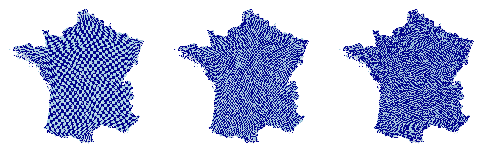
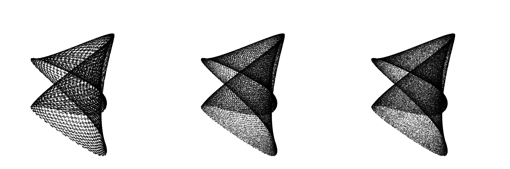
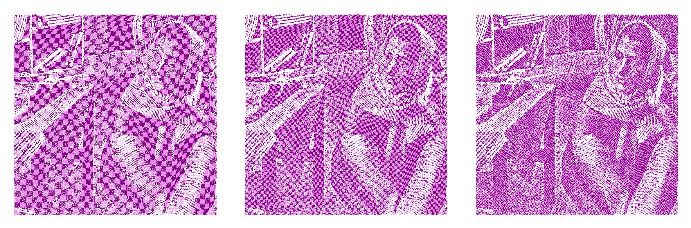
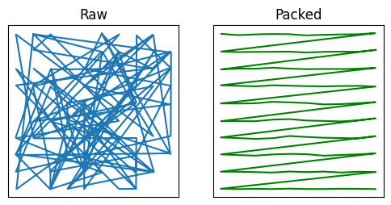

-----
[](https://colab.research.google.com/github/ArmanddeCacqueray/SquareNet/blob/main/00_getting_started.ipynb)
[](https://pypi.org/project/squarenet/)
[](https://squarenet.readthedocs.io/en/latest/)






❒  SquareNet

SquareNet maps unstructured **point clouds** to structured grids through a **bijective transformation**. It replaces expensive spatial queries (k-NN, radius search) with super fast **sliding window** operations. Think of it as a powerful alternative to kd-trees, voxelization, rasterization and neighborhood graphs.
✔ Works in any dimension
✔ Handles non-convex geometries
✔ Scales to millions of points (fast processing)
✔ Support for Pytorch and Jax

[Animation ✨](https://github.com/ArmanddeCacqueray/SquareNet/blob/main/gridification.gif)
-----

## 🚀 Why SquareNet?

  * **Speed:** $O(N)$ local operations via vectorized sliding windows.
  * **Memory:** Contiguous memory access instead of irregular spatial lookups.
  * **Simplicity:** No heavy spatial dependencies, pure native sorting logic

## 📦 Installation

```bash
pip install squarenet
```

## 🧠 Quick Start 
-> 00_getting_started.ipynb

```python
from squarenet import SquareNet
import numpy as np

# Initialize and Fit
N = 5*11*7*13
d = 4
X = np.random.rand(N, d)

IJKL = (5, 11, 7, 13)
sn = SquareNet(IJ_=IJKL) # Define grid dimensions, here 4D
sn.fit(x)

# Map any data indexed on the points e.g (N, *C) to the grid 
Xgrid = sn.map(X) #(5, 11, 7, 13, 4)
#and back
sn.invert_map(Xgrid)   # = X
```
## Query neighbors
```python
# d-dimensional query method
# approximate but super fast
sn.search_sorted(point) 
```

## 🗺️ Visualizing the Mapping

```python
sn = SquareNet(IJ_=(400, 400))
sn.fit("france") 
sn.plot(style = "mesh")
```


## 📈 Key Applications

  * **Point-Cloud Processing:** Fast spatial querys (neighbors, intersections...).
  * **Kernel Methods:** Efficient approximation of large kernels (sparse Gram matrix).
  * **Deep Learning:** Tensorization of flat datasets (CNN-Ready)

<p align="center">
  
</p>
-----

**License:** MIT | **Author:** [ArmanddeCacqueray](mailto:armanddecacqueray@sfr.fr)
