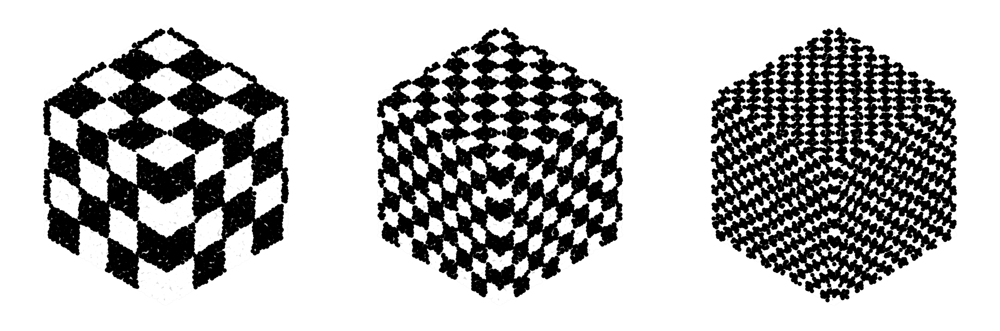

SquareNet — Tensor-based spatial processing
===========================================

Welcome to SquareNet documentation.

SquareNet is a framework for structured tensor grids for spatial learning.

.. image:: ../../plots/plot_7.png
   :width: 600px

.. include:: ../../README.md
   :parser: myst_parser.sphinx_

.. toctree::
   :maxdepth: 2
   :caption: Contents

   modules